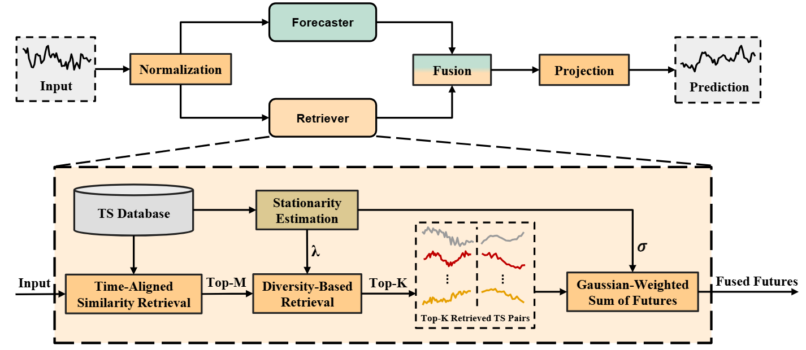

# SARAF：平稳性感知的检索增强时间序列预测（论文复现）

[](https://arxiv.org/abs/2606.04135)  [📄 论文 PDF](2606.04135v1.pdf)

本仓库是论文 **《Stationarity-Aware Retrieval-Augmented Time Series Forecasting》**（KDD 2026）的**复现（Reproduction）**工作，并非论文作者发布的官方实现，仅用于学习与研究。

## 1. 论文简介

检索增强的时间序列预测通常基于一个假设：**历史上相似的片段，未来走势也相似**。然而这一假设在真实世界的时间序列中并不总是成立——不同数据集的平稳性（stationarity）差异很大。在高度非平稳的序列（例如汇率类数据）中，两个历史窗口在过去看起来相似，但未来可能走向截然不同的方向。

为此，论文提出了 **SARAF**，让检索过程具备**平稳性感知（stationarity-aware）**能力。它不再只依赖时间相似度，而是自适应地结合以下三个机制：

- **时间对齐检索（Time-aligned retrieval）**：强化具有时间意义的、时序上可对齐的历史证据；
- **多样性感知检索（Diversity-aware retrieval）**：避免冗余的相似邻居，覆盖异质的历史状态（regimes）；
- **平稳性感知聚合（Stationarity-aware aggregation）**：根据数据集的平稳性程度，控制检索到的未来片段如何被融合。

简而言之，SARAF 不仅追问：

> “哪些历史片段与查询最相似？”

还会追问：

> “它们的未来走势在什么时候值得被信任？”

这使得检索增强预测在非平稳场景下更加鲁棒，同时在相对平稳的数据集上保留了基于相似度检索的优势。



## 2. 复现说明

本仓库在 **Windows + CPU** 环境下完成了论文方法的复现，主要工作包括：

- 依据论文实现 SARAF 模型及长时序预测（long-term forecasting）实验流程；
- 针对原始代码在 Windows 环境下无法直接运行的问题进行了适配与优化（详见 [`FIXES.md`](FIXES.md)）：
  - 修复 `WinError 1455`（DataLoader 多进程加载 DLL 导致页面文件不足）；
  - 解决大规模数据集（如 Electricity）上的内存溢出（OOM）问题，峰值内存由约 48.8 GB 降至约 1.4 GB。

## 3. 项目结构

```
SARAF/
├── run.py                  # 训练 / 测试入口
├── models/                 # SARAF 模型定义
├── layers/                 # 检索、分解等核心层
├── exp/                    # 训练、测试流程封装
├── data_provider/          # 数据加载
├── utils/                  # 指标、平稳性检验、增广等工具
├── scripts/                # 各数据集的运行脚本
├── fig/                    # 论文框架图
├── checkpoints/            # 模型权重（checkpoint）
├── test_results/           # 测试输出
├── data/                   # 数据集（需自行下载，见下文）
└── requirements.txt        # 依赖
```

## 4. 环境要求

- Python 3.8
- 主要依赖（见 `requirements.txt`）：torch、numpy、pandas、scipy、scikit-learn、sktime、matplotlib、tqdm

安装依赖：

```bash
pip install -r requirements.txt
```

## 5. 数据准备

在 `./data` 目录下放置各数据集文件。标准基准数据集（ETT、Electricity、Exchange、Traffic、Solar）可从 [Autoformer Google Drive](https://drive.google.com/drive/folders/13Cg1KYOlzM5C7K8gK8NfC-F3EYxkM3D2) 下载。

数据目录结构示例：

```
data/
├── ETT/               # ETTh1.csv, ETTh2.csv, ETTm1.csv, ETTm2.csv
├── electricity/       # electricity.csv
├── exchange_rate/     # exchange_rate.csv
├── traffic/           # traffic.csv
└── ...
```

## 6. 运行方式

### 使用脚本（推荐）

```bash
# ETTh + ETTm（seq_len=720）
bash scripts/ETTh_720.sh

# Electricity
bash scripts/elec_720.sh

# Exchange Rate
bash scripts/exchange_rate_720.sh

# Traffic
bash scripts/traffic_720.sh

# Solar
bash scripts/solar_720.sh
```

### 直接运行单个实验

```bash
python -u run.py \
  --task_name long_term_forecast \
  --is_training 1 \
  --root_path ./data/exchange_rate/ \
  --data_path exchange_rate.csv \
  --model_id exchange_rate_720_96 \
  --model SARAF \
  --data exchange_rate \
  --features M \
  --seq_len 720 \
  --label_len 48 \
  --pred_len 96 \
  --enc_in 8 --dec_in 8 --c_out 8 \
  --topm 2 \
  --seed 2021 \
  --itr 1
```

> 说明：在 Windows 环境下无需额外设置，代码会自动将 `num_workers` 置 0 以避免 `WinError 1455`。

## 7. 复现结果

在当前 Windows CPU 环境下，部分已验证结果（以 Exchange Rate 为例）：

| 数据集 | 配置 | MSE | R² |
|--------|------|-----|-----|
| Exchange Rate | seq=96, pred=96 | 0.0825 | 0.952 |
| Exchange Rate | seq=720, pred=96 | 0.0852 | 0.951 |

> 完整结果请参考 `test_results/`、`results/` 目录及 [`FIXES.md`](FIXES.md)。

## 8. 修改与优化

复现过程中对代码的修改与内存优化详见 [`FIXES.md`](FIXES.md)。

## 9. 参考与致谢

本复现工作参考了以下开源项目：

- [RAFT](https://arxiv.org/abs/2505.04163)
- [Time-Series-Library](https://github.com/thuml/Time-Series-Library)

## 10. 引用

如需引用原论文，请使用：

```bibtex
@misc{zhou2026saraf,
  title         = {Stationarity-Aware Retrieval-Augmented Time Series Forecasting},
  author        = {Zhou, Shiqiao and Sch{\"o}ner, Holger and Wu, Zipeng and Fouch{\'e}, Edouard and Wilson, IAG and Wang, Shuo},
  year          = {2026},
  doi           = {10.48550/arXiv.2606.04135},
  url           = {https://arxiv.org/abs/2606.04135}
}
```

## 免责声明

本仓库为学术复现用途，仅用于学习与研究，不保证与论文结果完全一致。